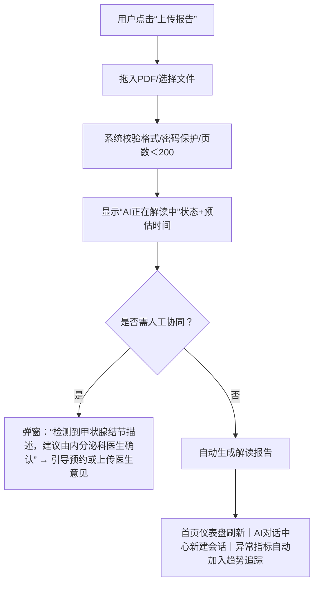

```markdown
# 📄 UI需求文档：AI健康报告解读与持续管理助手

> **版本**：1.2  
> **最后更新**：2024年6月  
> **适用角色**：产品经理、UI/UX设计师、前端开发、合规与医学内容顾问  

---

## 1. 页面概述（Page Overview）

| 项目 | 说明 |
|------|------|
| **产品名称** | AI健康报告解读与持续管理助手 |
| **核心定位** | 面向个人及家庭用户的**非诊断型AI健康管理协同工具**，聚焦体检报告深度解读、多维健康建议生成、长期指标追踪与可信赖的AI对话交互。 |
| **关键价值主张** | “一次上传，持续守护”——让每份体检报告成为长期健康旅程的起点，而非一次性结论。 |
| **目标用户** | 关注健康的成年人（25–65岁）、慢性病风险人群、家庭健康管理者（如为父母/子女管理健康档案） |
| **合规基线** | 严格遵循《互联网诊疗监管办法》《生成式AI服务管理暂行办法》《个人信息保护法》，所有AI输出标注“辅助参考，不替代临床诊断”，禁止使用“确诊”“治疗”“处方”等医疗行为动词。 |

---

## 2. 页面结构与布局（Layout Architecture）

采用**双栏+主工作区**响应式布局（桌面端），移动端适配为**分层卡片流+底部导航**：

```
┌───────────────────────────────────────────────────────┐
│ 顶部导航栏：Logo｜健康档案切换｜消息通知｜用户设置   │
├───────────────────────────────────────────────────────┤
│ 左侧垂直导航栏（固定｜可收起）                         │
│ • 首页（仪表盘）                                        │
│ • 我的报告（含上传入口+列表）                           │
│ • 健康档案（家庭成员Tab｜异常指标聚合视图）             │
│ • AI对话中心（带未读标记｜最近3个会话快捷入口）         │
│ • 设置与合规中心（含隐私政策、免责声明、数据导出）      │
├───────────────────────────────────────────────────────┤
│ 主内容区（动态加载｜支持Tab切换）                      │
│ ▸ 默认：【首页】→ 健康概览仪表盘 + 近期AI建议摘要        │
│ ▸ 【我的报告】→ PDF上传区 + 报告状态看板（待解析/已就绪）│
│ ▸ 【健康档案】→ 成员列表 + 异常指标趋势图（支持时间筛选） │
│ ▸ 【AI对话中心】→ 对话历史列表 + 当前会话窗口（含记忆锚点）│
└───────────────────────────────────────────────────────┘
```

> ✅ **设计约束**：  
> - 左侧导航栏默认展开（桌面端），首次进入时高亮「首页」；移动端折叠为底部Tab Bar（首页｜报告｜档案｜对话｜我）。  
> - 所有页面顶部显示**全局合规提示条**（浅蓝底+白字+感叹号图标）：“⚠️ 本工具提供健康信息参考，不用于疾病诊断、治疗或用药决策。请以医生面诊为准。”

---

## 3. 核心功能模块与UI规格

### 3.1 PDF报告上传与状态管理（我的报告）

| 元素 | 规格说明 | 交互与状态 |
|------|----------|-------------|
| **上传区域（主视觉焦点）** | 卡片式拖拽区（300×200px），中央图标+大号文字：“📄 拖入PDF体检报告，或点击上传”；支持多选、单次最多5份；文件名自动提取（如“张伟_202405体检.pdf”） | • Hover：边框变深蓝+阴影<br>• 点击后唤起系统文件选择器<br>• 支持直接粘贴PDF截图（OCR预处理） |
| **报告状态看板** | 表格形式，列：报告名称｜上传时间｜当前状态｜操作（查看/重传/归档） | 状态标签：<br>• `等待解析`（灰底）<br>• `AI正在解读中`（蓝底+旋转图标+预估耗时：“约2分18秒”）<br>• `已就绪`（绿底+✅）<br>• `需人工协同确认`（橙底+✏️，触发弹窗引导医生确认流程） |
| **异步处理透明化组件** | 进度条下方固定显示：<br>▸ 当前阶段：“语义解析 → 异常识别 → 指南匹配 → 建议生成”<br>▸ 可操作项：“暂停任务”（仅限未完成）｜“重新提交”（失败时）｜“查看日志”（开发者模式开关） | 后台完成时：桌面端右下角Toast推送 + 消息中心红点；移动端推送通知（含摘要：“张伟2024报告已解读完成，点击查看营养建议”） |

### 3.2 健康档案与多成员管理（健康档案）

| 元素 | 规格说明 | 交互与状态 |
|------|----------|-------------|
| **成员管理卡** | 每成员独立卡片（头像/姓名/年龄/关系），右上角「…」菜单：编辑资料｜设为主档案｜移除（需二次确认） | • 默认显示“本人”为主档案<br>• 家庭成员支持扫码邀请（生成专属二维码）<br>• 新增成员时强制填写基础健康信息（性别、出生年份、基础病史选项） |
| **异常指标聚合视图（核心可视化）** | 水平滚动卡片组，每张卡片代表1项关键指标（如空腹血糖、LDL-C、尿酸），含：<br>• 指标名称+单位（小号灰色）<br>• 当前值（加粗+色块：绿色≤正常上限｜黄色超限但＜警戒值｜红色≥警戒值）<br>• 趋势箭头（↑↓→）+变化幅度（如“↑12.3% vs 2023”）<br>• 点击展开：近3次测量趋势折线图（X轴：时间｜Y轴：数值｜带参考区间带） | • 时间范围筛选器：全部｜近1年｜近2年｜自定义<br>• 图表支持长按导出PNG｜分享至微信/邮件（脱敏水印：“本图由AI健康助手生成，仅供参考”） |
| **档案级AI建议摘要** | 卡片底部固定栏：“📌 基于您最新报告，AI为您生成了3类建议：营养（2条）、运动（1条）、监测（1条）” → 点击跳转至对应AI对话上下文 |

### 3.3 AI对话中心（记忆驱动型交互）

| 元素 | 规格说明 | 交互与状态 |
|------|----------|-------------|
| **对话历史列表** | 左侧竖排，每项含：<br>• 头像/昵称 + 报告标识（如“张伟｜2024体检”）<br>• 最后一条消息摘要（截断至30字）+ 时间（如“2小时前”）<br>• 未读数徽章（红底白字） | • 点击进入会话详情页<br>• 长按支持：置顶｜归档｜删除（需确认）<br>• 支持按“报告来源”“关键词”搜索 |
| **当前会话窗口（主工作区）** | 顶部记忆锚点横幅：<br>`🔍 当前上下文：张伟（2024体检+2023随访）｜关注指标：空腹血糖、尿酸｜上次对话：2024-05-22`<br>消息气泡区分：<br>• 用户：右对齐｜浅蓝底<br>• AI：左对齐｜白底+左侧蓝色竖条（宽度4px）+头像图标 | • AI回复中**所有建议均带权威来源标签**：<br>  `💡 营养建议：每日增加膳食纤维至25g（依据《中国居民膳食指南2022》）`<br>• 每条AI回复末尾自动追加合规脚注：<br>  `ℹ️ 此建议基于公开指南与您的报告数据生成，个体情况请咨询注册医师。`<br>• 支持消息内嵌操作：`“查看该指标趋势图”`（点击跳转图表）｜`“对比2023报告”`（并排对比视图） |
| **输入区** | 底部固定，含：<br>• 文本输入框（占位符：“例如：为什么我的尿酸升高？下一步该查什么？”）<br>• 语音输入按钮（麦克风图标）<br>• 快捷指令按钮（折叠面板）：`“总结最新报告”`｜`“生成下周饮食计划”`｜`“提醒我复查尿酸”` | • 发送后立即显示“AI正在思考…”（带微动波纹动画）<br>• 输入框支持@提及指标（如“@空腹血糖”自动高亮关联数据） |

### 3.4 首页仪表盘（健康概览）

| 元素 | 规格说明 | 交互与状态 |
|------|----------|-------------|
| **健康快照卡片** | 三列响应式布局：<br>• 「今日关注」：当前最需干预的1项指标（红/黄标+行动按钮：“查看建议”）<br>• 「趋势洞察」：近30天指标波动热力图（X轴日期｜Y轴指标｜颜色深浅=变化幅度）<br>• 「AI建议进度」：环形进度条显示“已执行建议数/总建议数”，点击展开明细列表 | • 所有图表默认启用“隐私模糊模式”（数值显示为区间，如“空腹血糖：5.2–5.6 mmol/L”）<br>• 点击任意卡片跳转至对应模块深度页 |
| **近期AI互动摘要** | 卡片式时间轴：<br>`[2024-05-25] 为您生成运动方案：每周3次快走，每次30分钟（依据AHA 2023）`<br>`[2024-05-22] 提醒复查尿酸：建议3个月后复检（参考KDIGO指南）` | • 每条摘要末尾带`“继续对话”`按钮，点击续接原上下文 |

---

## 4. 交互流程说明（Key User Flows）

### 流程1：首次上传报告 → 获取解读报告


### 流程2：跨报告对比分析（如对比2023 & 2024）
- 用户在AI对话中输入：“对比这两年的血脂指标”
- 系统自动：
  - 识别两份报告中的同源指标（TC, LDL-C, HDL-C, TG）
  - 在对话窗口内嵌**双柱状对比图**（2023 vs 2024｜参考区间标尺）
  - 生成分析文本：“LDL-C从3.8→4.2 mmol/L（↑10.5%），超过《中国成人血脂异常防治指南》推荐目标（＜3.4）”
  - 结尾追加：“💡 建议：增加植物固醇摄入，3个月后复查”

---

## 5. 组件规格说明（Design System Tokens）

| 类别 | 值 | 说明 |
|------|----|------|
| **主色系** | `#2563EB`（科技蓝）｜`#10B981`（健康绿）｜`#F59E0B`（警示橙）｜`#EF4444`（危险红） | 严格用于状态指示，禁用在按钮背景等交互元素上误导用户 |
| **字体** | 主体：`Inter`（西文） + `HarmonyOS Sans SC`（中文）｜字号：正文14px｜标题16–18px | 所有指标数值使用`tabular-nums`（等宽数字）确保对齐 |
| **合规文案库** | 全局统一调用：<br>• 免责声明模板<br>• AI话术后缀库（如“此为通用建议…”“请结合临床评估…”）<br>• 来源标注规范（指南名称+年份+条款号可选） | 所有AI生成内容通过CMS动态注入，不可硬编码 |
| **无障碍（a11y）** | • 所有图表提供`<figcaption>`与`aria-label`<br>• 对话气泡添加`role="log"`<br>• 颜色对比度≥4.5:1（AA级） | 通过axe DevTools全链路扫描 |

---

## 6. 状态与反馈设计（States & Feedback）

| 场景 | 反馈方式 | 规则 |
|------|-----------|------|
| **AI处理中** | • 页面级半透明遮罩（带logo+“AI正在深度分析…”）<br>• 进度条+阶段说明+倒计时<br>• 允许用户最小化窗口，后台继续运行 | 若超5分钟未完成，自动触发降级策略：返回“基础解读版”（无协同确认）+邮件通知 |
| **数据异常** | • 指标值超出合理生理范围（如血红蛋白＞200g/L）→ 显示`⚠️ 数据疑似异常，请核对报告原始值`<br>• PDF解析失败 → 提供OCR文本预览+手动修正入口 | 所有异常提示附带“反馈问题”按钮，直连医学审核后台 |
| **记忆缺失** | 当用户提问涉及未上传报告的指标时：<br>`🔍 当前档案中未包含[血压]数据。您可上传新报告，或手动录入历史记录。` | 不猜测、不编造，明确告知数据边界 |

---

## 7. 响应式适配建议

| 设备类型 | 关键策略 |
|----------|-----------|
| **桌面端（≥1280px）** | 全功能双栏布局；图表默认显示完整坐标轴与图例；支持拖拽调整仪表盘卡片位置 |
| **平板（768–1279px）** | 左侧导航折叠为顶部Tab；主区改为单列；趋势图切换为横向滚动区域 |
| **手机（≤767px）** | 底部Tab主导航；所有图表启用“滑动缩放”手势；对话输入框上浮，避免键盘遮挡；关键按钮放大至48×48px触控区 |

---

## ✅ 合规性专项检查清单（交付前必验）

- [ ] 全局免责声明在**每个页面顶部固定显示**（非页脚），且无法被滚动隐藏  
- [ ] 所有AI生成建议末尾含**不可删除的合规脚注**（字体不小于12px）  
- [ ] 用户导出的任何图表/PDF均自动嵌入**半透明水印**：“AI健康助手｜仅供参考｜生成时间：YYYY-MM-DD”  
- [ ] 医学术语首次出现时提供**悬浮释义**（如“LDL-C：低密度脂蛋白胆固醇，俗称‘坏胆固醇’”）  
- [ ] 健康档案删除操作需**双重验证**（输入验证码+勾选“我理解此操作不可恢复”）  
- [ ] 所有API调用日志留存≥180天，满足审计要求  

---
> **文档审批栏**  
> 产品负责人：__________________  
> 医学顾问：__________________  
> 合规官：__________________  
> UX设计负责人：__________________  
> 日期：_______年_______月_______日  
```